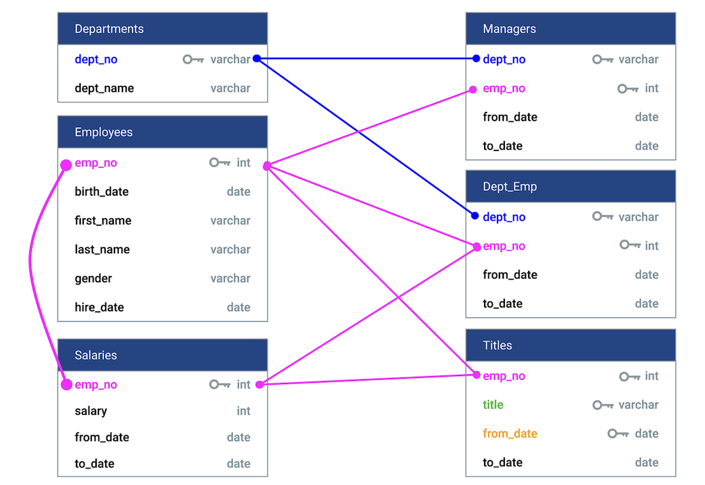
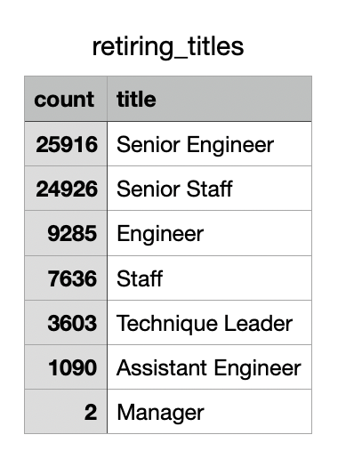

# Pewlett-Hackard-Analysis

## Overview
Previoulsy, we analyzed Pewlett Hackard's employee data using SQL. The goal was to identify employees who are nearing retirement and create reports that the PH management can use to prepare for this transition. In this challenge, two new analysis were added:
- a report summarizing the count of retiring employees by their current title
- a report identifying experienced employees who can mentor the next generation of PH employees

## Results

PH's employee data was stored in six disconnected files. Therefore, the first step was to build a database connecting the different data using Postgres/pgAdmin. 

 
Using this database, we built queries to extract various reports on PH's retiring employees. Two reports were extracted for this challenge:

1. Count of retiring employees by their current title

- 72,458 employees can be expected to retire soon
- Many of the retiring employees are senior engineers and senior staff 
- Two of the nine department managers are expected to retire soon

2. List of employees who are eligible to participate in the mentorship initiative

- 1,549 eligible employees were identified 

## Summary
Based on this analysis, 72,458 roles will need to be filled as the large retirement wave begins. There does not appear to be enough qualified employees to mentor the next generation PH employees. The following queries can provide additional insight:

1. Count of retiring employees by department and title. This can help PH focus on the departments that are impacted the most

2. Count of eligible mentors for each department, and expand the criteria to see if that can alleviate the shortage in mentors

